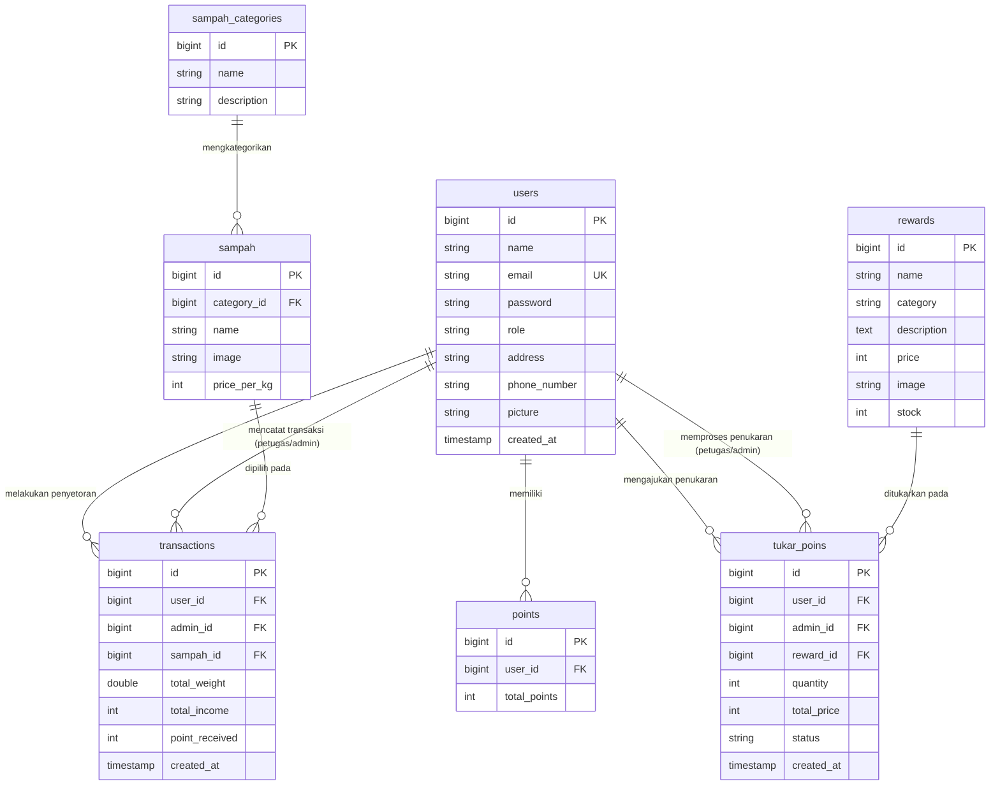

# Entity Relationship Diagram (ERD) - Banksampah

Dokumen ini memuat diagram relasi antar entitas (ERD) beserta kamus data lengkap untuk sistem database **Banksampah**.

---

## 1. Diagram ERD (Mermaid)

---

## 2. Kamus Data (Data Dictionary)

### 2.1 Entitas Pengguna (`users`)
Menyimpan data identitas pengguna (Nasabah, Admin, Super Admin) yang terdaftar pada aplikasi.

| Nama Kolom | Tipe Data | Constraint | Keterangan |
| :--- | :--- | :--- | :--- |
| `id` | `bigint(20) unsigned` | **PK**, Auto Increment | Identifier unik pengguna |
| `name` | `varchar(255)` | NOT NULL | Nama lengkap pengguna |
| `email` | `varchar(255)` | **UK**, NOT NULL | Email login pengguna |
| `password` | `varchar(255)` | NOT NULL | Password terenkripsi (Bcrypt) |
| `role` | `varchar(50)` | NOT NULL | Peran pengguna (`nasabah`, `admin`, `super_admin`) |
| `address` | `varchar(255)` | NULLable | Alamat tempat tinggal pengguna |
| `phone_number` | `varchar(255)` | NULLable | Nomor telepon / WhatsApp |
| `picture` | `varchar(255)` | NULLable | Path foto profil pengguna |
| `created_at` | `timestamp` | NULLable | Waktu pendaftaran akun |
| `updated_at` | `timestamp` | NULLable | Waktu pembaruan akun |

---

### 2.2 Entitas Kategori Sampah (`sampah_categories`)
Mengkategorikan kelompok sampah (misal: Plastik, Kertas, Logam, Kaca).

| Nama Kolom | Tipe Data | Constraint | Keterangan |
| :--- | :--- | :--- | :--- |
| `id` | `bigint(20) unsigned` | **PK**, Auto Increment | Identifier unik kategori |
| `name` | `varchar(255)` | NOT NULL | Nama kategori sampah |
| `description` | `varchar(255)` | NOT NULL | Deskripsi singkat kategori |

---

### 2.3 Entitas Data Sampah (`sampah`)
Menyimpan item jenis sampah spesifik beserta tarif harganya.

| Nama Kolom | Tipe Data | Constraint | Keterangan |
| :--- | :--- | :--- | :--- |
| `id` | `bigint(20) unsigned` | **PK**, Auto Increment | Identifier unik item sampah |
| `category_id` | `bigint(20) unsigned` | **FK** ➔ `sampah_categories.id` | ID Kategori sampah |
| `name` | `varchar(255)` | NOT NULL | Nama jenis sampah (misal: Botol PET) |
| `image` | `varchar(255)` | NOT NULL | Path gambar item sampah |
| `price_per_kg` | `int(11)` | NOT NULL | Harga nominal rupiah per kilogram |

---

### 2.4 Entitas Data Reward (`rewards`)
Menyimpan item barang/hadiah yang dapat ditukarkan menggunakan poin.

| Nama Kolom | Tipe Data | Constraint | Keterangan |
| :--- | :--- | :--- | :--- |
| `id` | `bigint(20) unsigned` | **PK**, Auto Increment | Identifier unik reward |
| `name` | `varchar(255)` | NOT NULL | Nama barang / voucher reward |
| `category` | `varchar(255)` | NOT NULL | Kategori reward |
| `description` | `text` | NOT NULL | Rincian deskripsi reward |
| `price` | `int(11)` | NOT NULL | Nilai harga dalam **Poin** |
| `image` | `varchar(255)` | NOT NULL | Path foto reward |
| `stock` | `int(11)` | NOT NULL | Jumlah stok barang tersedia |

---

### 2.5 Entitas Transaksi Penyetoran (`transactions`)
Mencatat setiap kali nasabah menyetorkan sampah ke bank sampah.

| Nama Kolom | Tipe Data | Constraint | Keterangan |
| :--- | :--- | :--- | :--- |
| `id` | `bigint(20) unsigned` | **PK**, Auto Increment | Identifier unik transaksi |
| `user_id` | `bigint(20) unsigned` | **FK** ➔ `users.id` | ID Nasabah pemilik transaksi |
| `admin_id` | `bigint(20) unsigned` | **FK** ➔ `users.id` | ID Admin/Petugas (dari tabel `users`) yang mencatat |
| `sampah_id` | `bigint(20) unsigned` | **FK** ➔ `sampah.id` | ID Sampah yang disetorkan |
| `total_weight` | `double(8,2)` | NOT NULL | Berat sampah dalam Kilogram (kg) |
| `total_income` | `int(11)` | NOT NULL | Total nominal uang (Rp) didapat |
| `point_received` | `int(11)` | NOT NULL | Total poin didapat dari transaksi |
| `created_at` | `timestamp` | NULLable | Tanggal & waktu transaksi |

---

### 2.6 Entitas Saldo Poin (`points`)
Menyimpan akumulasi sisa saldo poin tiap nasabah.

| Nama Kolom | Tipe Data | Constraint | Keterangan |
| :--- | :--- | :--- | :--- |
| `id` | `bigint(20) unsigned` | **PK**, Auto Increment | Identifier unik poin |
| `user_id` | `bigint(20) unsigned` | **FK** ➔ `users.id` | ID Nasabah pemilik saldo poin |
| `total_points` | `int(11)` | NOT NULL | Akumulasi sisa saldo poin aktif |

---

### 2.7 Entitas Penukaran Poin (`tukar_poins`)
Mencatat klaim penukaran poin nasabah dengan barang reward.

| Nama Kolom | Tipe Data | Constraint | Keterangan |
| :--- | :--- | :--- | :--- |
| `id` | `bigint(20) unsigned` | **PK**, Auto Increment | Identifier unik pengajuan |
| `user_id` | `bigint(20) unsigned` | **FK** ➔ `users.id` | ID Nasabah pengaju |
| `admin_id` | `bigint(20) unsigned` | **FK** ➔ `users.id` | ID Admin (dari tabel `users`) yang memproses |
| `reward_id` | `bigint(20) unsigned` | **FK** ➔ `rewards.id` | ID Reward yang dipilih |
| `quantity` | `int(11)` | NOT NULL | Jumlah item reward yang diklaim |
| `total_price` | `int(11)` | NOT NULL | Total potongan harga poin |
| `status` | `varchar(255)` | NOT NULL | Status: `Pending`, `On Process`, `Diterima` |
| `created_at` | `timestamp` | NULLable | Tanggal & waktu pengajuan |
